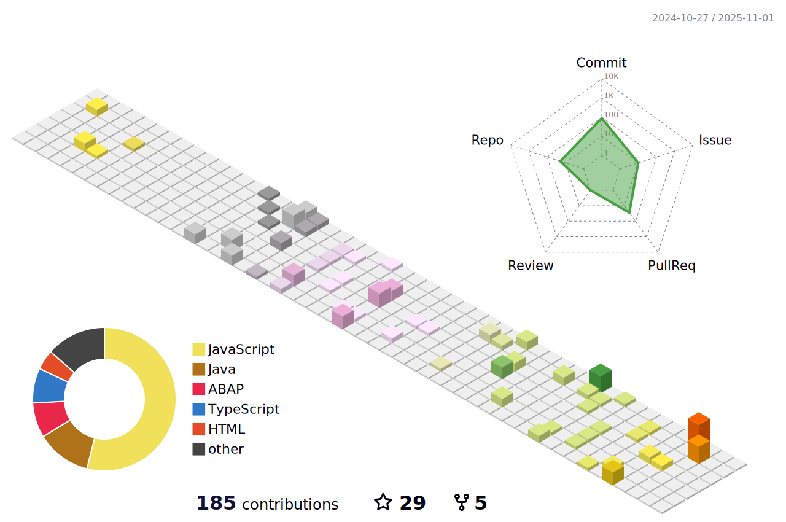

   
<!--  -->

<h2>Hi there  &nbsp;  I am Bhaskar Kulshrestha </h2>
<!--    -->
   <h4 align="center">🌟Full Stack Web developer | Artificial Intelligence | Machine Learning | Competitive Programming🌟</h4>
  

<!-- -->

<!--  -->

 

- 🔭 I’m currently working on **My Problem solving and development skills**.

- 🌱 I’m currently learning **C++,Python,Full Stack Development,Machine Learning**. 

- 👯 I’m looking to collaborate on various projects and become a good software developeer / web developer in a good MNC.

- 💬 Ask me about **Data structures and algorithms,Web development,Machine Learning,Artificial Intelligence**. 

- 📫 How to reach me:  
            &nbsp; &nbsp; Gmail : bhaskarkulshrestha03@gmail.com  
            &nbsp; &nbsp;LinkedIn : https://www.linkedin.com/in/bhaskar-kulshrestha/  
            &nbsp; &nbsp;Website : https://bhaskar-kulshrestha-portfolio.vercel.app/

 

<!--Connect with me-->

## Connect with me:

   &nbsp; &nbsp; &nbsp; &nbsp;
   &nbsp; &nbsp; &nbsp; &nbsp;
   &nbsp; &nbsp; &nbsp; &nbsp;

## Coding Profiles:

&nbsp; &nbsp; &nbsp; &nbsp;
 &nbsp; &nbsp; &nbsp; &nbsp;

 
<!--language and tools-->

## Languages and Tools:

 
<!--  . -->
 .
 .
 .
 .
 .
 .
 .
 .
 .
.
 . 
. 
 .
 .
 .
<!--  -->

 
 

<!-- Statistics -->
&nbsp;
    
   <!--   CURRENTLY NOT WORKING     -->
    
<!-- 
   Most used Languges               |   Statical Analytics
   :-------------------------:  |   :-------------------------:
    &nbsp;&nbsp;&nbsp; | &nbsp;&nbsp;&nbsp; 
 -->

## Open Source Contribution in HacktoberFest

## Contibution Graph

   
   
Most used Languges               |   Statical Analytics
   :-------------------------:  |   :-------------------------:
    &nbsp;&nbsp;&nbsp; | &nbsp;&nbsp;&nbsp; 
   
   
&nbsp;&nbsp;&nbsp; &nbsp;&nbsp;&nbsp; &nbsp;&nbsp;&nbsp;&nbsp;&nbsp;&nbsp; &nbsp;&nbsp;&nbsp; &nbsp;&nbsp;&nbsp;&nbsp;&nbsp;&nbsp; &nbsp;&nbsp;&nbsp; &nbsp;&nbsp;&nbsp;&nbsp;&nbsp;&nbsp; &nbsp;&nbsp;&nbsp; &nbsp;&nbsp;&nbsp;

<!-- 
&nbsp;
 -->

<!--     -->
   
<!--    -->
 
 

### 🔝 Top Contributed Repo

### Leetcode Profile

  

